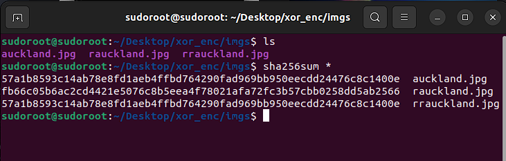

# XOR File Encryption #


> JCtine

This work is a built up on the [project done by simon](https://github.com/mightbesimon/XOR-file-encryption)

Encrypts files with a password byte-by-byte using a XOR cipher.

## New!
* Added Reversing the File as a block: File is broken into blocks of size given by the user and the block is reversed and replaced.
* This Prevents decryption by bruteforcing the Password 

Decryption is the same process,  
only the password *used to encrypt* will decrypt the file.

### compile ###

```bash
$ gcc enc.c -o xore #Just encrypting engine
$ gcc dec.c -o xord #Just decrypting engine
$ gcc both.c -o xorb #This alone is enough
```

### Usage ###

```
$ ./xorb <mode[-e or -d]> <filename> <password> <reversing block size[<16]>
```

### Example ###
```bash
$ ./xorb -e auckland.jpg password1 13
$ ./xore auckland.jpg passwdd123 13
```
will produce `rauckland.jpg` file, to decrypt:
```bash
$ ./xorb -d rauckland.jpg password1 13
$ ./xord rauckland.jpg passwdd123 13
```
`rrauckland.jpg` will be identical to the original
## Hashes
The Hash of auckland.jpg and rrauckland.jpg is same



## Authors ##
- **JCtine** - [ZeroX29a](https://github.com/ZeroX29a)
- **simon** - [mightbesimon](https://github.com/mightbesimon)

## License ##

MIT

## Acknowledgments ##

- **these are just my sample codes, if you misuse them its not my problem**
